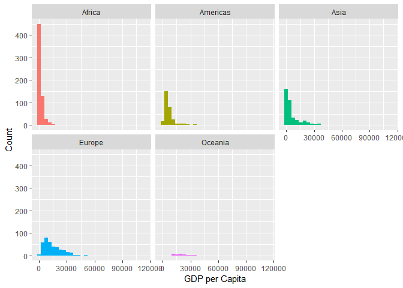
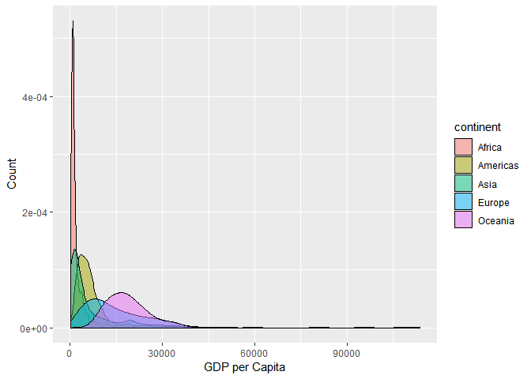
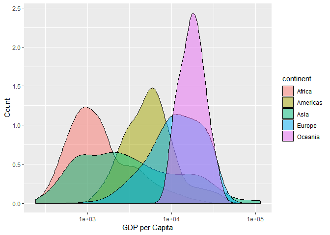
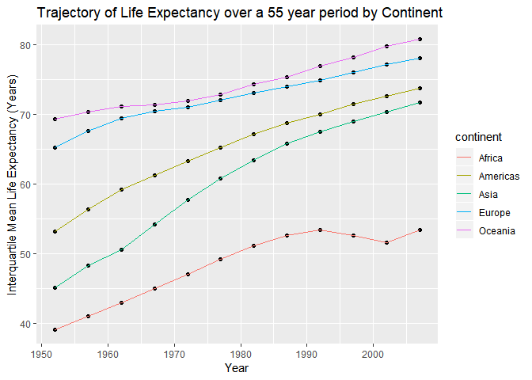
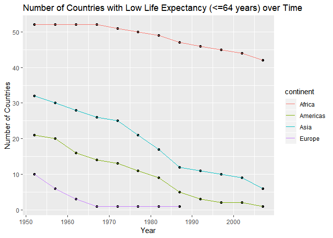

STAT545 Assignment 2
================
Alex
October 1, 2018

Initializing Gapminder Dataset and Libraries
--------------------------------------------

``` r
library(tidyverse)
library(ggplot2)
library(gapminder)

# these two packages help make very pretty tables
library(knitr)
library(kableExtra)
```

Tasks Attempted
---------------

<table style="width:25%;">
<colgroup>
<col width="13%" />
<col width="11%" />
</colgroup>
<thead>
<tr class="header">
<th>Task</th>
<th>Attempted</th>
</tr>
</thead>
<tbody>
<tr class="odd">
<td>Max and Min GDP per Capita for all continents</td>
<td>:heavy_check_mark:</td>
</tr>
<tr class="even">
<td>Distribution of GDP per capita within continents</td>
<td>:heavy_check_mark:</td>
</tr>
<tr class="odd">
<td>Mean Life Expectancy for different years weighted</td>
<td>:heavy_check_mark:</td>
</tr>
<tr class="even">
<td>Life Expectancy Trajectory over time on different continents</td>
<td>:heavy_check_mark:</td>
</tr>
<tr class="odd">
<td>Relative Life Expectancy Exploration</td>
<td>:heavy_check_mark:</td>
</tr>
<tr class="even">
<td>Open-ended exploration of <strong>interesting</strong> country histories</td>
<td>:heavy_check_mark:</td>
</tr>
</tbody>
</table>

Max and Min GDP per Continent
-----------------------------

``` r
gapminder %>%
  group_by(continent,country) %>%
  summarize(mu = mean(gdpPercap)) %>%
  summarize(max = round(max(mu),2),
            min = round(min(mu),2)) %>%
  kable(col.names = c("Continent", "Max. GDP per Capita", "Min. GDP per Capita"), "html") %>%
  kable_styling(bootstrap_options = c("striped", "hover", "condensed", full_width = F))
```

    ## Warning: package 'bindrcpp' was built under R version 3.5.1

<table class="table table-striped table-hover table-condensed" style="margin-left: auto; margin-right: auto;">
<thead>
<tr>
<th style="text-align:left;">
Continent
</th>
<th style="text-align:right;">
Max. GDP per Capita
</th>
<th style="text-align:right;">
Min. GDP per Capita
</th>
</tr>
</thead>
<tbody>
<tr>
<td style="text-align:left;">
Africa
</td>
<td style="text-align:right;">
12013.58
</td>
<td style="text-align:right;">
471.66
</td>
</tr>
<tr>
<td style="text-align:left;">
Americas
</td>
<td style="text-align:right;">
26261.15
</td>
<td style="text-align:right;">
1620.74
</td>
</tr>
<tr>
<td style="text-align:left;">
Asia
</td>
<td style="text-align:right;">
65332.91
</td>
<td style="text-align:right;">
439.33
</td>
</tr>
<tr>
<td style="text-align:left;">
Europe
</td>
<td style="text-align:right;">
27074.33
</td>
<td style="text-align:right;">
3255.37
</td>
</tr>
<tr>
<td style="text-align:left;">
Oceania
</td>
<td style="text-align:right;">
19980.60
</td>
<td style="text-align:right;">
17262.62
</td>
</tr>
</tbody>
</table>
We group by continent and country, and then summarize first by mean, then summarize by max and min of our previously calculated means. Piping this in kable presents us with the above table. We see that Europe contains the country with the highest GDP per capita as well as the country with the highest *minimum* GDP per capita, while Africa contains both the **lowest** max. and min. GDP per capita. This suggests that the standard of living on average is highest in Europe and lowest in Africa.

The country with the lowest range in GDP per capita is Oceania, but this may be in part due to the fact that there are not as many countries in Oceania as there are in the other 4 continents.

### Distribution of GDP per capita within continents

Although the previous section gave us some interesting information on the range of GDP per capita within continents, we do not have any informatino about the distribution of GDP per capita within each continent. To visualize the spread of GDP per Capita, a first guess would be to use histograms and facet by Continent. However, as we see from above it is not as illuminating as we would like; most of the graph is filled with blank space due to the skewness of the distributions (and due to facetting with the same x,y axes scales).

``` r
gapminder %>%
  ggplot(aes(gdpPercap)) +
  geom_histogram(aes(fill = continent)) +
  facet_wrap( ~ continent) +
  guides(fill=FALSE) +
  labs(x="GDP per Capita", y="Count")
```



Another idea would be to try a density plot and overlay the distributions on top of each other:

``` r
gapminder %>%
  ggplot(aes(gdpPercap)) +
  geom_density(aes(fill = continent), alpha=0.5) +
  labs(x="GDP per Capita", y="Count")
```



This makes it easier to visually compare continents with each other, but we can probably do better by adding a log scale to the x-axis.

``` r
gapminder %>%
  ggplot(aes(gdpPercap)) +
  geom_density(aes(fill = continent), alpha=0.5) +
  labs(x="GDP per Capita", y="Count") +
  scale_x_log10()
```



Much better! (Although keep in mind log scales make it harder to make good quantitative judgements.) From this graph we can quickly see that Asia contains the greatest variance in GDP per capita, followed by Africa. Between Africa and Asia, Africa has a considerably higher peak towards the low end of the GDP per capita distribution, reflecting what we found earlier that Africa contains both the lowest max. and min. GDP per capita across all continents.

Trimmed Mean Life Expectancy in the Americas
--------------------------------------------

A trimmed mean removes a portion of the largest and smallest elements in a set before computing the mean. This can be useful in situations where our data is skewed or non-normal in some way, allowing us to increase robustness while sacrificing efficiency for less heavily-tailed distributions such as the normal distribution [(ref: https://en.wikipedia.org/wiki/Truncated\_mean)](https://en.wikipedia.org/wiki/Truncated_mean) In R, we can achieve this by specifying the `trim` option in `mean()`.

Let's look at the trimmed mean life expectancy in the Americas for different years. We will trim by 25% on both ends (this is known as the interquartile mean (IQM)):

``` r
table <- gapminder %>% # I save the output to "table" so that I can omit columns later when piping into kable for presentation. There may be a better way to do this
  filter(continent == "Americas") %>%
  group_by(continent, year) %>%
  summarize(intqrt_mean = round(mean(lifeExp, trim=0.25),2))
table[2:3] %>%
  kable(col.names = c("Year", "Interquartile Mean Life Expectancy"), "html") %>%
  kable_styling(bootstrap_options = c("striped", "hover", "condensed", full_width = F))
```

<table class="table table-striped table-hover table-condensed" style="margin-left: auto; margin-right: auto;">
<thead>
<tr>
<th style="text-align:right;">
Year
</th>
<th style="text-align:right;">
Interquartile Mean Life Expectancy
</th>
</tr>
</thead>
<tbody>
<tr>
<td style="text-align:right;">
1952
</td>
<td style="text-align:right;">
53.17
</td>
</tr>
<tr>
<td style="text-align:right;">
1957
</td>
<td style="text-align:right;">
56.41
</td>
</tr>
<tr>
<td style="text-align:right;">
1962
</td>
<td style="text-align:right;">
59.23
</td>
</tr>
<tr>
<td style="text-align:right;">
1967
</td>
<td style="text-align:right;">
61.27
</td>
</tr>
<tr>
<td style="text-align:right;">
1972
</td>
<td style="text-align:right;">
63.24
</td>
</tr>
<tr>
<td style="text-align:right;">
1977
</td>
<td style="text-align:right;">
65.21
</td>
</tr>
<tr>
<td style="text-align:right;">
1982
</td>
<td style="text-align:right;">
67.15
</td>
</tr>
<tr>
<td style="text-align:right;">
1987
</td>
<td style="text-align:right;">
68.72
</td>
</tr>
<tr>
<td style="text-align:right;">
1992
</td>
<td style="text-align:right;">
69.99
</td>
</tr>
<tr>
<td style="text-align:right;">
1997
</td>
<td style="text-align:right;">
71.51
</td>
</tr>
<tr>
<td style="text-align:right;">
2002
</td>
<td style="text-align:right;">
72.62
</td>
</tr>
<tr>
<td style="text-align:right;">
2007
</td>
<td style="text-align:right;">
73.75
</td>
</tr>
</tbody>
</table>
Here we see that at the earliest timepoint in this dataset, the Americas had an IQM of 53.17, and steadly increased at each 5 year timepoint until reaching 73.75 in 2007, increasing by a total of 20.58 years over a period of 55 years. We can visualize this using a line plot:

``` r
table %>%
  ggplot(aes(year,intqrt_mean)) +
  geom_point(colour = "Blue") + 
  geom_line(colour = "Red") +
  labs(title="Life Expectancy in the Americas over a 55 year period", x="Year", y="Interquartile Mean Life Expectancy (Years)")
```


This leads quite well to the next task, where we will look at change in life expectancy over time in all continents!

Life Expectancy Change Over Time in Each Continent
--------------------------------------------------

We can use what we learned from the previous task and apply it to each continent to look at life expectancy change over time for each continent. A first thought is that it would be interesting to plot them all on the same graph. For consistency we will continue using the interquartile mean.

``` r
gapminder %>%
#  filter(continent == "Americas") %>% # comment out the filter() to apply to all continents. Easy!
  group_by(continent, year) %>%
  summarize(intqrt_mean = round(mean(lifeExp, trim=0.25),2)) %>%
  ggplot(aes(year,intqrt_mean)) +
  geom_point(colour = "Black") +
  geom_line(aes(group=continent, colour = continent)) +
  labs(title="Trajectory of Life Expectancy over a 55 year period by Continent", x="Year", y="Interquartile Mean Life Expectancy (Years)")
```



From this we see that all continents have a trend of increasing life expectancy over time. However, in Africa there was a period of decrease in life expectancy from 1997 to 2002. This suggests that there was some period of turmoil between 1997 and 2002 either in some countries in Africa. An interesting thing to note is that the life expectancy trajectories of each continent **never** cross one another; if one continent had a higher life expectancy than another in 1952, they will also have a higher life expectancy in any other year.

Relative Life Expectancy Exploration
------------------------------------

Let us consider the relative life expectancies between continents. First we must decide on some definition of *low life expectancy*. Although it may make more statistical sense to choose a quantity such as mean or median life expectancy within all continents, I feel that a more poignant and relevant choice would be the current **average age of graduate students in Canada**. The average age of graduate students in Canada at the time of Master's degree graduation was **32 years** ((Source: statista.com, 2000-2010))\[<https://www.statista.com/statistics/451808/average-masters-degree-graduation-age-in-canada/>\]. I will define low life expectancy as lower than or equal to 64, as that means that at the average age of Master's graduate in Canada, you will have **half** of your life in those countries.

Here is the proportion of countries in each continent with a low life expectancy (&lt;= 64 years) in 1952:

``` r
a <- gapminder %>%
  filter(year == "1952") %>%
  group_by(continent,country) %>%
  summarize(mu = mean(lifeExp)) %>%
  mutate(num_countries = n()) %>%
  filter(mu <= 64) %>%
  mutate(prop = n() / num_countries * 100) %>% # Calculate the proportion of total countries that have low life Exp per continent
  summarize(numlowlifeExp = n(),
            prop = mean(prop)) # prop = mean(prop) is a very spaghetti code way to add a column with the proportion of low lifeExp countries. There is likely a better way to do this

a %>%
  kable(col.names = c("Continent", "Number of Low Life Expectancy Countries", "Percent of Total Countries with Low Life Expectancy"), "html") %>%
  kable_styling(bootstrap_options = c("striped", "hover", "condensed", full_width = F))
```

<table class="table table-striped table-hover table-condensed" style="margin-left: auto; margin-right: auto;">
<thead>
<tr>
<th style="text-align:left;">
Continent
</th>
<th style="text-align:right;">
Number of Low Life Expectancy Countries
</th>
<th style="text-align:right;">
Percent of Total Countries with Low Life Expectancy
</th>
</tr>
</thead>
<tbody>
<tr>
<td style="text-align:left;">
Africa
</td>
<td style="text-align:right;">
52
</td>
<td style="text-align:right;">
100.00000
</td>
</tr>
<tr>
<td style="text-align:left;">
Americas
</td>
<td style="text-align:right;">
21
</td>
<td style="text-align:right;">
84.00000
</td>
</tr>
<tr>
<td style="text-align:left;">
Asia
</td>
<td style="text-align:right;">
32
</td>
<td style="text-align:right;">
96.96970
</td>
</tr>
<tr>
<td style="text-align:left;">
Europe
</td>
<td style="text-align:right;">
10
</td>
<td style="text-align:right;">
33.33333
</td>
</tr>
</tbody>
</table>
Over 80% of countries in Africa, America, and Asia have low life expectancy in 1952. This should not be surprising, as we know that life expectancy is markedly lower in the 50s. What may be surprising is that Europe and Oceania have less than 35% of countries with low life expectancy in 1952. In particular, Oceania does not even appear in the above graph as they contained zero countries with low life expectancy and was thus filtered out by `filter(mu <= 64)`. (For the future, should probably look for a way to include it into the graph without excess spaghetti coding.) This suggests that in the 50s, Europe and Oceania had a higher standard of living compared to other continents in this time period.

We should also look at how this evolves over time; however, a table would not be the best way to present this as it would be much too long. Instead, we could again use a line plot:

``` r
gapminder %>%
  group_by(year,continent,country) %>%
  summarize(mu = mean(lifeExp)) %>%
  mutate(num_countries = n()) %>%
  filter(mu <= 64) %>%
  mutate(prop = n() / num_countries * 100) %>% # Calculate the proportion of total countries that have low life Exp per continent
  summarize(numlowlifeExp = n(),
            prop = mean(prop)) %>%
  ggplot(aes(year,numlowlifeExp)) +
  geom_point(colour = "Black") +
  geom_line(aes(group=continent, colour=continent)) +
  labs(title="Number of Countries with Low Life Expectancy (<=64 years) over Time", x="Year", y="Number of Countries")
```



From the figure we see that for all continents, the number of countries with low life expectancy goes down for each 5 year period. Europe in particular no longer has countries with low life expectancy by our definition by the year 1987. What is striking however is the huge number of countries with low life expectancy in Africa relative to the other continents. In addition, the number of countries with low life expectancy does not decrease with time as much as the other continents.
