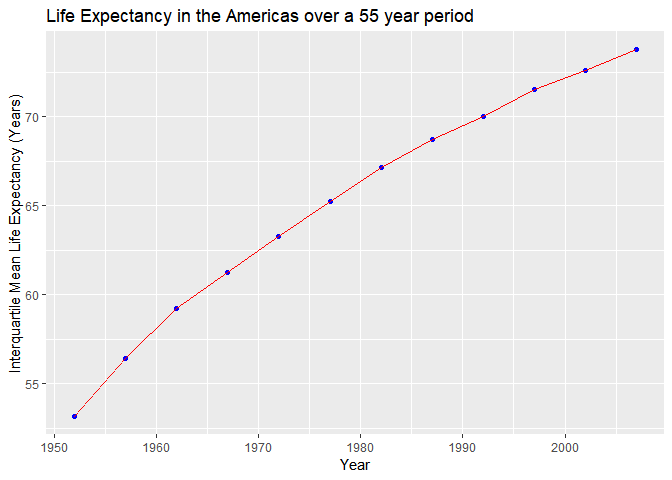

STAT545 Assignment 2
================
Alex
October 1, 2018

Initializing Gapminder Dataset and Libraries
--------------------------------------------

``` r
library(tidyverse)
library(ggplot2)
library(gapminder)

# these two packages help make very pretty tables
library(knitr)
library(kableExtra)
```

Tasks Attempted
---------------

<table style="width:25%;">
<colgroup>
<col width="13%" />
<col width="11%" />
</colgroup>
<thead>
<tr class="header">
<th>Task</th>
<th>Attempted</th>
</tr>
</thead>
<tbody>
<tr class="odd">
<td>Max and Min GDP per Capita for all continents</td>
<td>:heavy_check_mark:</td>
</tr>
<tr class="even">
<td>Distribution of GDP per capita within continents</td>
<td>:heavy_check_mark:</td>
</tr>
<tr class="odd">
<td>Mean Life Expectancy for different years weighted</td>
<td>:heavy_check_mark:</td>
</tr>
<tr class="even">
<td>Life Expectancy Trajectory over time on different continents</td>
<td>:heavy_check_mark:</td>
</tr>
<tr class="odd">
<td>Relative Life Expectancy Exploration</td>
<td>:heavy_check_mark:</td>
</tr>
<tr class="even">
<td>Open-ended exploration of <strong>interesting</strong> country histories</td>
<td>:heavy_check_mark:</td>
</tr>
</tbody>
</table>

Max and Min GDP per Continent
-----------------------------

``` r
gapminder %>%
  group_by(continent,country) %>%
  summarize(mu = mean(gdpPercap)) %>%
  summarize(max = round(max(mu),2),
            min = round(min(mu),2)) %>%
  kable(col.names = c("Continent", "Max. GDP per Capita", "Min. GDP per Capita"), "html") %>%
  kable_styling(bootstrap_options = c("striped", "hover", "condensed", full_width = F))
```

    ## Warning: package 'bindrcpp' was built under R version 3.5.1

<table class="table table-striped table-hover table-condensed" style="margin-left: auto; margin-right: auto;">
<thead>
<tr>
<th style="text-align:left;">
Continent
</th>
<th style="text-align:right;">
Max. GDP per Capita
</th>
<th style="text-align:right;">
Min. GDP per Capita
</th>
</tr>
</thead>
<tbody>
<tr>
<td style="text-align:left;">
Africa
</td>
<td style="text-align:right;">
12013.58
</td>
<td style="text-align:right;">
471.66
</td>
</tr>
<tr>
<td style="text-align:left;">
Americas
</td>
<td style="text-align:right;">
26261.15
</td>
<td style="text-align:right;">
1620.74
</td>
</tr>
<tr>
<td style="text-align:left;">
Asia
</td>
<td style="text-align:right;">
65332.91
</td>
<td style="text-align:right;">
439.33
</td>
</tr>
<tr>
<td style="text-align:left;">
Europe
</td>
<td style="text-align:right;">
27074.33
</td>
<td style="text-align:right;">
3255.37
</td>
</tr>
<tr>
<td style="text-align:left;">
Oceania
</td>
<td style="text-align:right;">
19980.60
</td>
<td style="text-align:right;">
17262.62
</td>
</tr>
</tbody>
</table>
We group by continent and country, and then summarize first by mean, then summarize by max and min of our previously calculated means. Piping this in kable presents us with the above table. We see that Europe contains the country with the highest GDP per capita as well as the country with the highest *minimum* GDP per capita, while Africa contains both the **lowest** max. and min. GDP per capita. This suggests that the standard of living on average is highest in Europe and lowest in Africa.

The country with the lowest range in GDP per capita is Oceania, but this may be in part due to the fact that there are not as many countries in Oceania as there are in the other 4 continents.

### Distribution of GDP per capita within continents

``` r
gapminder %>%
  ggplot(aes(gdpPercap)) +
  geom_histogram(aes(fill = continent)) +
  facet_wrap( ~ continent) +
  guides(fill=FALSE) +
  labs(x="GDP per Capita", y="Count")
```

    ## `stat_bin()` using `bins = 30`. Pick better value with `binwidth`.


To visualize the spread of GDP per Capita, a first guess would be to use histograms and facet by Continent. However, as we see from above it is not as illuminating as we would like; most of the graph is filled with blank space due to the skewness of the distributions (and due to facetting with the same x,y axes scales). Another idea would be to try a density plot and overlay the distributions on top of each other:

``` r
gapminder %>%
  ggplot(aes(gdpPercap)) +
  geom_density(aes(fill = continent), alpha=0.5) +
  labs(x="GDP per Capita", y="Count")
```


This makes it easier to visually compare continents with each other, but we can probably do better by adding a log scale to the x-axis.

``` r
gapminder %>%
  ggplot(aes(gdpPercap)) +
  geom_density(aes(fill = continent), alpha=0.5) +
  labs(x="GDP per Capita", y="Count") +
  scale_x_log10()
```


Much better! (Although keep in mind log scales make it harder to make good quantitative judgements.) From this graph we can quickly see that Asia contains the greatest variance in GDP per capita, followed by Africa. Between Africa and Asia, Africa has a considerably higher peak towards the low end of the GDP per capita distribution, reflecting what we found earlier that Africa contains both the lowest max. and min. GDP per capita across all continents.

### Quantitative Variable

Let's look at some details about the `lifeExp` variable. This variable tells us the life expectancy of a certain population of a country for a specific year.

``` r
summary(gapminder$lifeExp)
```

    ##    Min. 1st Qu.  Median    Mean 3rd Qu.    Max. 
    ##   23.60   48.20   60.71   59.47   70.85   82.60

A quick summary tells us the mean lifeExp over all countries is 59.47 years, and that the lifeExp variable ranges between 23.6 and 82.6 years. Below is the distribution of lifeExp in different continents:

``` r
gapminder %>%
  ggplot(aes(lifeExp)) +
  geom_histogram(aes(fill = continent)) +
  facet_wrap( ~ continent) + # allows us to make a separate histogram for each continent
  guides(fill=FALSE) # remove the legend as it is largely redundant after facetting
```



Let's calculate at the mean and standard deviation lifeExp of each continent. The function `aggregate()` allows us to apply a function to each column of a sub dataframe that we specify:

``` r
a <- aggregate(gapminder$lifeExp ~ gapminder$continent, FUN=mean) # this is to save our output into a matrix so that we can make it into a nice table
b <- aggregate(gapminder$lifeExp ~ gapminder$continent, FUN=sd)
a[3] <- b[2]
a %>%
  kable(col.names = c("Continent", "Mean Life Exp (Yrs)", "SD Life Exp (Yrs)"),"html") %>% #col.names inside kable() alows us to rename our columns
  kable_styling(bootstrap_options = c("striped", "hover", "condensed"), full_width = F)
```

<table class="table table-striped table-hover table-condensed" style="width: auto !important; margin-left: auto; margin-right: auto;">
<thead>
<tr>
<th style="text-align:left;">
Continent
</th>
<th style="text-align:right;">
Mean Life Exp (Yrs)
</th>
<th style="text-align:right;">
SD Life Exp (Yrs)
</th>
</tr>
</thead>
<tbody>
<tr>
<td style="text-align:left;">
Africa
</td>
<td style="text-align:right;">
48.86533
</td>
<td style="text-align:right;">
9.150210
</td>
</tr>
<tr>
<td style="text-align:left;">
Americas
</td>
<td style="text-align:right;">
64.65874
</td>
<td style="text-align:right;">
9.345088
</td>
</tr>
<tr>
<td style="text-align:left;">
Asia
</td>
<td style="text-align:right;">
60.06490
</td>
<td style="text-align:right;">
11.864532
</td>
</tr>
<tr>
<td style="text-align:left;">
Europe
</td>
<td style="text-align:right;">
71.90369
</td>
<td style="text-align:right;">
5.433178
</td>
</tr>
<tr>
<td style="text-align:left;">
Oceania
</td>
<td style="text-align:right;">
74.32621
</td>
<td style="text-align:right;">
3.795611
</td>
</tr>
</tbody>
</table>
From this we see that Oceania has the highest life expectancy on average, while Africa has the lowest life expectancy on average.

### Practice using filter(), select(), and %&gt;%

Let's look at how Canada compares to the top 10 countries in terms of GDP per capita in 2007!

First we filter out just data from 2008, then we will select only country, lifeExp, pop, and gdpPercap (omitting year and continent as that is not very interesting now to compare). Then we can use arrange() to sort by descending GDP per capita, and use slice() to take out the top 10 countries by GDP per capita:

``` r
gapminder %>%
  filter(year == 2007) %>%
  select(country, lifeExp, pop, gdpPercap) %>%
  arrange(desc(gdpPercap)) %>%
  slice(1:10) %>% #slice(1:10) returns everything from row 1 to row 10
  kable(col.names = c("Country", "Life Exp (Yrs)", "Population (Persons)", "GDP Per Cap. ($)"), "html") %>%
  kable_styling(bootstrap_options = c("striped", "hover", "condensed"), full_width = F)
```

<table class="table table-striped table-hover table-condensed" style="width: auto !important; margin-left: auto; margin-right: auto;">
<thead>
<tr>
<th style="text-align:left;">
Country
</th>
<th style="text-align:right;">
Life Exp (Yrs)
</th>
<th style="text-align:right;">
Population (Persons)
</th>
<th style="text-align:right;">
GDP Per Cap. ($)
</th>
</tr>
</thead>
<tbody>
<tr>
<td style="text-align:left;">
Norway
</td>
<td style="text-align:right;">
80.196
</td>
<td style="text-align:right;">
4627926
</td>
<td style="text-align:right;">
49357.19
</td>
</tr>
<tr>
<td style="text-align:left;">
Kuwait
</td>
<td style="text-align:right;">
77.588
</td>
<td style="text-align:right;">
2505559
</td>
<td style="text-align:right;">
47306.99
</td>
</tr>
<tr>
<td style="text-align:left;">
Singapore
</td>
<td style="text-align:right;">
79.972
</td>
<td style="text-align:right;">
4553009
</td>
<td style="text-align:right;">
47143.18
</td>
</tr>
<tr>
<td style="text-align:left;">
United States
</td>
<td style="text-align:right;">
78.242
</td>
<td style="text-align:right;">
301139947
</td>
<td style="text-align:right;">
42951.65
</td>
</tr>
<tr>
<td style="text-align:left;">
Ireland
</td>
<td style="text-align:right;">
78.885
</td>
<td style="text-align:right;">
4109086
</td>
<td style="text-align:right;">
40676.00
</td>
</tr>
<tr>
<td style="text-align:left;">
Hong Kong, China
</td>
<td style="text-align:right;">
82.208
</td>
<td style="text-align:right;">
6980412
</td>
<td style="text-align:right;">
39724.98
</td>
</tr>
<tr>
<td style="text-align:left;">
Switzerland
</td>
<td style="text-align:right;">
81.701
</td>
<td style="text-align:right;">
7554661
</td>
<td style="text-align:right;">
37506.42
</td>
</tr>
<tr>
<td style="text-align:left;">
Netherlands
</td>
<td style="text-align:right;">
79.762
</td>
<td style="text-align:right;">
16570613
</td>
<td style="text-align:right;">
36797.93
</td>
</tr>
<tr>
<td style="text-align:left;">
Canada
</td>
<td style="text-align:right;">
80.653
</td>
<td style="text-align:right;">
33390141
</td>
<td style="text-align:right;">
36319.24
</td>
</tr>
<tr>
<td style="text-align:left;">
Iceland
</td>
<td style="text-align:right;">
81.757
</td>
<td style="text-align:right;">
301931
</td>
<td style="text-align:right;">
36180.79
</td>
</tr>
</tbody>
</table>
From this we see that Canada ranked 9th in GDP per Capita in 2007. Out of these top 10 countries, Canada ranks 4th in life expectancy at a mean 80.653 years. The majority of countries on this top 10 list have populations below 10 million, with exceptions being the United States at 301.1 million, Canada at 33.4 million, and Netherlands at 16.6 million.
